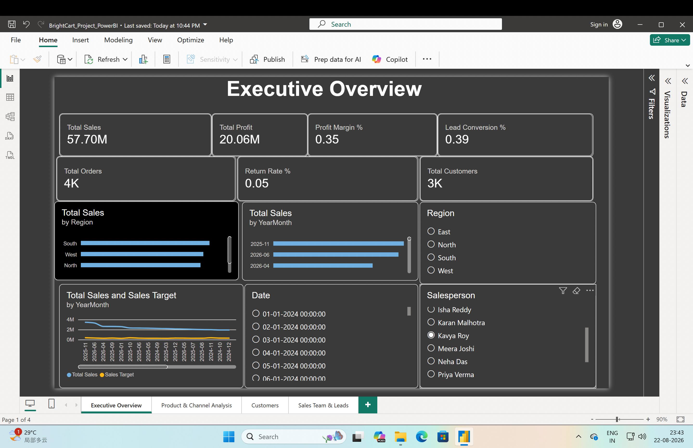
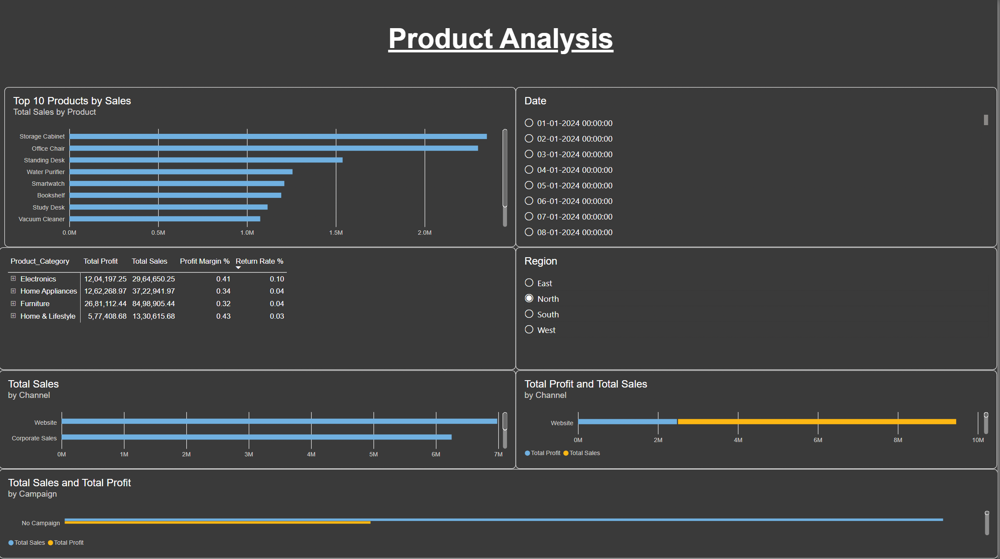
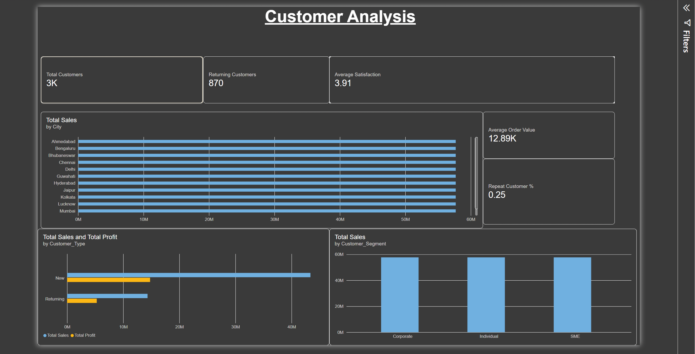
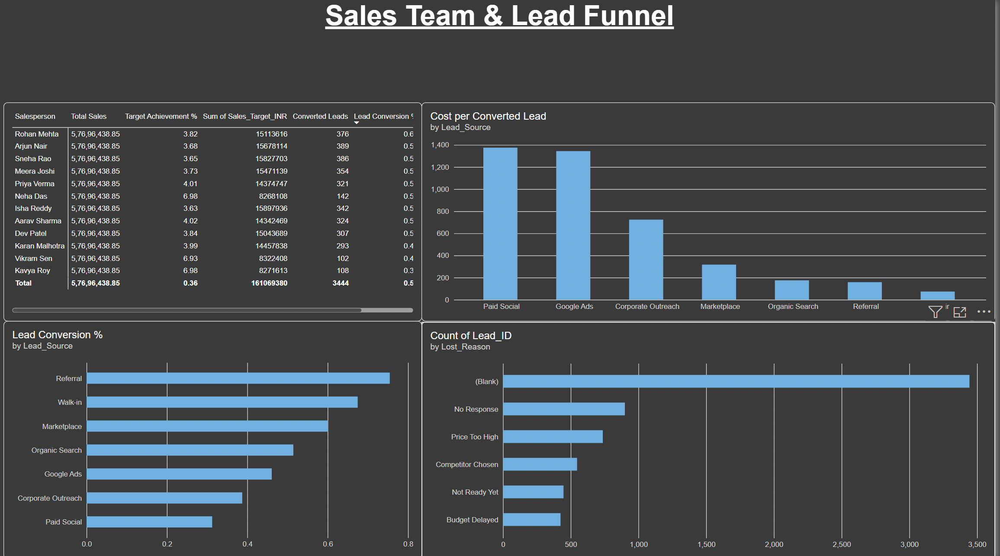

# BrightCart-Sales-Analytics
End-to-end sales analytics project using Excel, SQL, Python and Power BI.
# BrightCart Sales Analytics Project

## Project Overview

BrightCart Sales Analytics is an end-to-end data analytics project focused on analyzing sales, profitability, products, customers, sales teams, leads, and marketing performance.

The project uses Microsoft Excel, SQL, Python, and Power BI to transform raw business data into meaningful business insights and recommendations.

## Business Problem

BrightCart wants to understand its overall sales and business performance and identify opportunities to improve revenue, profitability, customer retention, sales-team performance, and lead-conversion efficiency.

### Key Business Questions

- Which products generate the highest sales and profit?
- Which regions perform best and worst?
- Are monthly sales targets being achieved?
- Which customer segments contribute the most revenue?
- Which salespeople perform best against their targets?
- Which lead sources convert most effectively?
- Which products have high return rates or weak profitability?

## Tools Used

- **Microsoft Excel** — Data cleaning, validation, formulas, pivot tables, and initial analysis
- **SQL** — KPI analysis, aggregations, and business queries
- **Python** — Exploratory Data Analysis using Pandas, NumPy, and visualization libraries
- **Power BI** — Data modeling, DAX measures, relationships, and interactive dashboards

## Project Workflow

Raw Data  
↓  
Excel Data Cleaning & Analysis  
↓  
SQL Business Analysis  
↓  
Python Exploratory Data Analysis  
↓  
Power BI Dashboard  
↓  
Business Insights  


## Power BI Dashboard

### 1. Executive Overview

Tracks:

- Total Sales
- Total Profit
- Profit Margin %
- Total Orders
- Total Customers
- Return Rate %
- Lead Conversion %
- Monthly Sales Trend
- Sales vs Sales Target
- Regional Performance



### 2. Product & Channel Analysis

Analyzes:

- Top 10 Products by Sales
- Product Profitability
- Profit Margin %
- Return Rate %
- Channel Performance
- Campaign Performance



### 3. Customer Analysis

Analyzes:

- Total Customers
- Returning Customers
- Repeat Customer %
- Average Order Value
- Average Satisfaction
- Customer Type
- Customer Segment
- City-level Sales



### 4. Sales Team & Lead Funnel

Analyzes:

- Salesperson Performance
- Sales Target
- Target Achievement %
- Total Leads
- Converted Leads
- Lead Conversion %
- Lead Source Performance
- Cost per Converted Lead
- Lost Lead Reasons



## Key Business Insights

- BrightCart generated **₹57.70M in total sales** and **₹20.06M in total profit**, resulting in an overall profit margin of approximately **35%**.
- Monthly sales showed a **fluctuating trend**, with **November 2025** recording the highest sales and **January 2024** recording the lowest sales.
- **November 2025** showed the strongest sales-target performance, while **December 2024** showed the weakest performance against target.
- The **South region** generated the highest sales, while the **East region** recorded the lowest sales.


## Repository Structure

```text
BrightCart-Sales-Analytics
│
├── 01_Data
├── 02_Excel
├── 03_SQL
├── 04_Python
├── 05_PowerBI
├── 06_Insights
├── 07_Images
└── README.md
